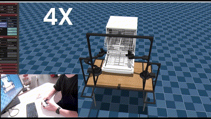

# Dualsense-ALOHA
Dualsense™ Controller Teleoperation and ACT autonomy IL on ALOHA for one Bigym benchmark task

- Insipred by the [Nitendo-Aloha](https://github.com/AlmondGod/Nintendo-Aloha)
- Reproduce the implementation and concept of Nintendo-Aloha and replace the controller to be compatible with Dualsense™ Controller
- Explore ACT IL, Mujoco, Warp
- Original Readme of [bigym](https://github.com/chernyadev/bigym)

## Data collection Teleoprate based on Dualsense controller: 
Teleoperation, refer to the [ds_aloha.py](controllers/demonstration/ds_aloha.py) script,based on [pydualsense](https://github.com/flok/pydualsense) library.

https://github.com/user-attachments/assets/cee4a915-c5a2-44ed-bc1a-9dd3fbc2a980

## Inference :
[Model training repository](https://github.com/wayne-xyz/act-bigym-aloha-dualsense)

Model inference entry point: [controllers/demonstration/run_inference_temporalAgg.py](controllers/demonstration/run_inference_temporalAgg.py)

https://github.com/user-attachments/assets/3fcfb062-d25a-4dc6-bb66-348202083eaa

## MuJoCo Warp Accelerator

## Reflections

### 1. Action Attenuation
After ACT model training, action outputs are often weaker than intended, leading to less accurate positioning (though movement direction is usually correct). This is likely due to most collected actions being near zero. To compensate, we apply a scaling factor to the inferred actions so the robot arm moves sufficiently. Comparing action distributions between the dataset and policy outputs is recommended.

https://github.com/user-attachments/assets/322c5117-98e4-4109-a300-b1feb3284f6b

### 2. Discrete Action Handling
Binary controller actions (e.g., action2, action9) can become diluted during training. To address this, we use MixUp interpolation to convert discrete actions into smoother, continuous values, improving model learning and inference.

### 3. MuJoCo Warp Suitability
MuJoCo Warp is optimized for fast, headless multi-world simulations and is not ideal for single-world, visualized policy inference.

### 4. Others
Model training throug colab by A100 about 2s per it.  vs my RTX3060 17s per it. 
