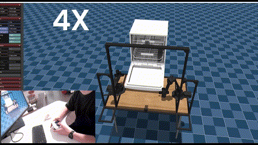

# Dualsense-ALOHA
Dualsense™ Controller Teleoperation and ACT autonomy IL on ALOHA for Bigym benchmark tasks 

- Insipred by the [Nitendo-Aloha](https://github.com/AlmondGod/Nintendo-Aloha)
- Reproduce the implementation and concept of Nintendo-Aloha and replace the controller to be compatible with Dualsense™ Controller
- Explore ACT IL, Mujoco, Warp
- Original Readme of [bigym](https://github.com/chernyadev/bigym)

## Data collection Teleoprate based on Dualsense controller: 

## Inference Demonstrate:

### ACT MODEL Train and Inference

[Model training repository](https://github.com/wayne-xyz/act-bigym-aloha-dualsense)

Model inference entry point: [controllers/demonstration/run_inference_temporalAgg.py](controllers/demonstration/run_inference_temporalAgg.py)

### Comparesion Learning : 

#### Training Results
- **One-pattern imitation learning success rate:** ~10%

#### Data Collection
- Each dataset follows the same movement pattern, repeating similar sequences of actions.  
  Example chain of movements:
  1. Move to the front of the door  
  2. Lower the arm  
  3. Move under the door  
  4. Door rotates to close  
  5. Left arm moves from down to up  

#### Action Data Issues
- **Inconsistency in actions:**  
  - Actions at indices `[2]` and `[9]` are based on a button press with values `(0.03, 0, -0.03)`.  
  - The ACT model converts these discrete values into continuous data, which weakens action performance.  

#### Inference Phase
- To improve inference, augmentation methods are applied, such as:  
  - **Weighted accumulation** based on a buffer  
  - **Multiplying by variables** to adjust and stabilize outputs  for the action[2] and [9]
