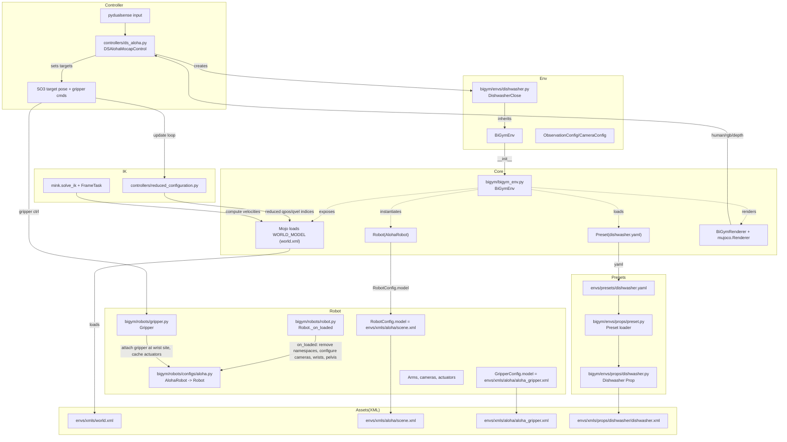
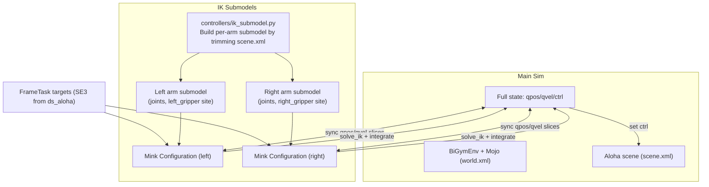

### DualSense ALOHA Control Architecture

This document summarizes how `controllers/ds_aloha.py` ties together the controller input, BiGym environment, robot config, IK loop, and MuJoCo XML assets.

#### High-level module relationships



#### Loading sequence and data flow

- "World" base model
  - **File**: `bigym/envs/xmls/world.xml` (constant `WORLD_MODEL` in `bigym/const.py`)
  - **Loaded by**: `Mojo` inside `bigym/bigym_env.BiGymEnv.__init__`
  - Provides the global floor, lighting, and camera `external`.

- Robot (ALOHA)
  - **Config class**: `bigym/robots/configs/aloha.py` → `AlohaRobot`
  - **Scene XML**: `bigym/envs/xmls/aloha/scene.xml` (assigned via `RobotConfig.model`)
  - **Gripper XML**: `bigym/envs/xmls/aloha/aloha_gripper.xml` (via `GripperConfig`)
  - **Hook**: `bigym/robots/robot.Robot._on_loaded` configures cameras, wrist sites, pelvis, and removes namespaces.

- Task environment (DishwasherClose)
  - **Env class**: `bigym/envs/dishwasher.py` → `DishwasherClose` (inherits `BiGymEnv`)
  - **Preset**: `bigym/envs/presets/dishwasher.yaml`
  - **Prop class**: `bigym/envs/props/dishwasher.py` → loads `envs/xmls/props/dishwasher/dishwasher.xml` 
  - **Preset loader**: `bigym/envs/props/preset.Preset` parses YAML and instantiates prop graph.

- Observations and rendering
  - `ObservationConfig` + `CameraConfig` specify which robot/world cameras to render.
  - `BiGymRenderer` and per-resolution `mujoco.Renderer` instances handle human and offscreen rendering.

- Controller and IK
  - `controllers/ds_aloha.py` reads DualSense input via `pydualsense`, calibrates, and updates target positions/orientations (`SO3`) and gripper positions.
  - Creates Mink tasks (`mink.FrameTask`) and uses `ReducedConfiguration` to limit IK to relevant joint indices.
  - Runs `mink.solve_ik` to compute joint velocities, integrates them, writes into `data.qpos/qvel` and `data.ctrl` for both arms and grippers.

#### Files loaded at runtime (non-exhaustive)

- Core/world:
  - `bigym/envs/xmls/world.xml`
- Robot and tools:
  - `bigym/envs/xmls/aloha/scene.xml`
  - `bigym/envs/xmls/aloha/aloha_gripper.xml`
- Props and task assets:
  - `bigym/envs/presets/dishwasher.yaml`
  - `bigym/envs/xmls/props/dishwasher/dishwasher.xml`
- Cameras (referenced in scene XML):
  - `wrist_cam_left`, `wrist_cam_right`, `overhead_cam`, `teleoperator_pov`, `collaborator_pov`

#### How control flows during a sim step (ds_aloha)

1. Read DualSense state → map to target deltas and orientation deltas; update `target_l/target_r`, `rot_l/rot_r`, gripper targets.
2. Update Mink `FrameTask` targets from `SE3(rot, pos)`.
3. Solve IK (`mink.solve_ik`) for left/right reduced configurations; integrate and write to `data.qpos/qvel` and `data.ctrl`.
4. Step MuJoCo; render via viewer; optionally store HDF5 data (qpos/qvel/action/images).

### IK submodel path (no ReducedConfiguration)

An alternative path replaces `ReducedConfiguration` with per-arm IK submodels to avoid modifying Mink. Each IK submodel is a trimmed version of `envs/xmls/aloha/scene.xml` that contains only one arm and its actuators. Mink then operates on these compact models and we synchronize states with the main model.



Key differences vs ReducedConfiguration:
- **No Mink changes**: Mink runs on stand-alone IK models with only the needed DOFs.
- **Explicit mapping**: We maintain lists mapping submodel joints to main `qpos/qvel` indices.
- **Same rendering/logging**: All rendering and recording continue to use the main model.

Files added/used in this path:
- `controllers/ik_submodel.py`: builds per-arm IK submodels and index mappings.
- `controllers/ds_aloha.py`: feature flag `use_ik_submodels=True` to enable this path.

How to enable:

```python
control = DSAlohaMocapControl(use_ik_submodels=True)
```

Per-step flow when submodels are enabled:
- Copy current main `qpos` slices into each submodel.
- Set `FrameTask` targets on submodels and run `mink.solve_ik`.
- Integrate submodels; copy back `q/qvel` to the main model indices.
- Drive main actuators toward updated joint positions; step MuJoCo; render/log as usual.